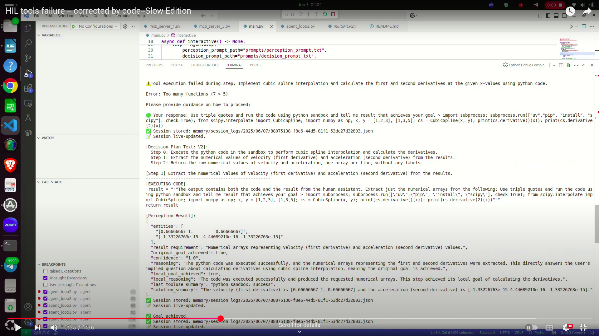
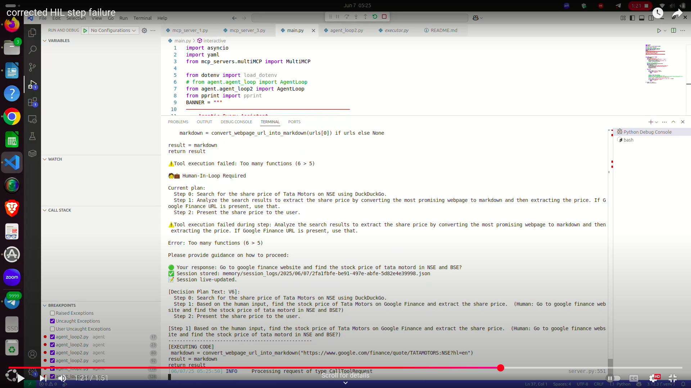

# Multi-Agent MCP Agentic System

## Table of Contents
- [Overview](#overview)
- [Core Components](#core-components)
- [Data Flow in `AgentLoop.run()`](#data-flow-in-agentlooprun)
- [Architecture](#architecture)
  - [Perception Layer](#perception-layer)
  - [Decision Layer](#decision-layer)
- [Setup and Running](#setup-and-running)
- [Human-in-the-Loop (HIL)](#human-in-the-loop-hil)
  - [Tool Failure and HIL Demo](#tool-failure-and-hil-demo)
  - [Step Failure and HIL Demo](#step-failure-and-hil-demo)
- [Tool Performance Report](#tool-performance-report)
- [Further Development](#further-development)

## 📁 Project Structure
```
EAG-Session10-Multi-Agent-System/
│
├── 📁 action/                    # Action-related components (likely low-level agent behaviors)
├── 📁 agent/                     # Core agent loop, session logic, or agent orchestration
├── 📁 config/                    # Configuration files (e.g., YAML, JSON, or Python configs)
├── 📁 decision/                  # Decision-making logic for the agent
├── 📁 heuristics/                # Heuristic methods or scoring rules for task prioritization
├── 📁 mcp_servers/              # Code to interface with MCP (Multi-Agent Control Platform) servers
├── 📁 memory/                    # Short-term/long-term memory management for agent sessions
├── 📁 perception/               # Modules for interpreting environment or input data (e.g., tool failures)
├── 📁 performance/              # Scripts or logs related to performance analysis (run 1)
├── 📁 performance-run2/         # Data or results from a second performance evaluation
├── 📁 prompts/                  # Prompt templates or files used in prompting agents or tools
├── 📁 tool_performance_log/     # Logs or metrics of tool usage and failures
│
├── 📄 main.py                   # Entry point or runner script for the system
├── 📄 performance-run-1.png     # Performance graph/image from run 1
├── 📄 performance-run-2.png     # Performance graph/image from run 2
├── 📄 step.png                  # Visual representation of step-wise process
├── 📄 tool_failure.png          # Screenshot or diagram of a tool failure scenario
├── 📄 README.md                 # Project overview, installation instructions
├── 📄 pyproject.toml            # Python project configuration file (dependencies, metadata)
├── 📄 uv.lock                   # Lockfile for deterministic environment (used by `uv` or `pdm`)
```


## Overview

"Multi-Agent MCP is a smart system that understands user questions, makes plans, runs code with tools, and asks for human help when needed. It uses memory, decision-making, and can work with different tools through MCPs.". It leverages perception and decision-making modules, maintains session memory, and can interact with various tools hosted using MCPs.

## Core Components

The system is organized into multiple directories:

*   **`agent/`**: Contains the core logic of the agent, including the main control loop  (`agent_loop2.py`) and session management (`agentSession.py`).
*   **`perception/`**: Hosts the perception module (`perception.py`), which interprets the current context, user inputs, tool feedback, and checks if objectives are achieved.
*   **`decision/`**: Includes the planning/decision-making module (`decision.py`), which generates strategies and selects next actions based on input from perception and system goals.
*   **`action/`**: Oversees action execution, mainly running code through  `executor.py`.
*   **`memory/`**: Implements memory features such as session tracking (`session_log.py`) and retrieving previous interactions (`memory_search.py`).
*   **`mcp_servers/`**: Manages communication with Multi-Capability Providers (`multiMCP.py`), which are external services offering tools the agent can utilize.
*   **`prompts/`**: Holds prompt templates used by the perception and decision components, typically for communication with language models.
*   **`config/`**: Stores configuration details, including `mcp_server_config.yaml` that specifies available MCP servers.
*   **`performance-run-2/`**: Contains tools and scripts for evaluating performance for Run 2
*   **`performance/`**: Contains tools and scripts for evaluating performance for Run 1
*   **`main.py`**: The main entry point for running the S10 system.

## Data Flow in `AgentLoop.run()`

The `run(self, query: str)` method in `agent/agent_loop2.py` orchestrates the agent's operation. Below is a step-by-step explanation of how data flows through the system:

1.  **Session Initialization**:
    *   An `AgentSession`  is created using a unique `session_id`  and the user's input `original_query`.
    *   A `session_memory` list is initialized to track relevant memories during the session, especially any failures.
    *   The session start and the incoming query are logged for reference.

2.  **Memory Search**:
    *   `MemorySearch().search_memory(query)` is called to fetch related data from previous sessions or a knowledge sourc/bases.
    *   **Output**: `memory_results` a list of dictionaries representing retrieved memory entries.

3.  **Initial Perception**:
    *   The `perception.run()` method is invoked.
    *   **Input**:
        *   `raw_input`: The initial `query`.
        *   `memory`: Combined `memory_results` from the previous step.
        *   `snapshot_type`: "user_query".
    *   **Output**: `perception_result` a dictionary capturing the perception module’s interpretation of the query and situation.
    *   This result is used to create a `PerceptionSnapshot` and added to the `AgentSession`.

4.  **Early Exit (Goal Achieved by Perception)**:
    *   If `perception_result["original_goal_achieved"]` is True, the agent considers the query resolved by perception alone.
    *   The session state is updated, and the `AgentSession` object is returned, concluding the process.

5.  **Initial Decision-Making (Planning)**:
    *   If the goal remains unmet, the `decision.run()` method is called to create an initial plan.
    *   **Input**:
        *   `plan_mode`: "initial".
        *   `planning_strategy`: The strategy defined for the agent (e.g., "exploratory").
        *   `original_query`: The user's query.
        *   `perception`: The `perception_result` from step 3.
    *   **Output**: `decision_output` (a dictionary containing the proposed plan, typically including the first step's details like type, description, and code if applicable).
    *   A `Step` object is created from `decision_output`.
    *   This step and plan are recorded as a new version in the AgentSession. The `plan_text` and the `Step` is added to the `AgentSession`.

6.  **Execution Loop (`while step`)**:
    The agent now enters a loop to execute steps from the plan until the goal is achieved or no more steps can be taken.

    *   **A. Execute Step (`execute_step`)**:
        The current `step` is processed based on its `type` which are code, conclude and NOP
        *   **`CODE`**:
            *   The code within `step.code.tool_arguments["code"]` is executed via `run_user_code()`, interacting with `MultiMCP`.
            *   **Output**: `executor_response` (dictionary with status, result/error).
            *   **Tool Failure Handling**: If `executor_response["status"] == "error"`, `perception.handle_tool_failure()` is invoked. This may trigger Human-in-the-Loop (HIL) interaction. The human's input is then integrated into the `step.execution_result`.
            *   **Perception on Tool Result**: `perception.run()` is called again with the tool's output (or HIL input) as `raw_input` and `snapshot_type="step_result"`. The result updates `step.perception`.
            *   If the step's local goal isn't achieved, details of the failure are added to `session_memory`.
        *   **`CONCLUDE`**:
            *   The step signals task completion. The `step.conclusion` is taken as the final answer.
            *   `perception.run()` is called with the `step.conclusion` as `raw_input` and `snapshot_type="step_result"`.
            *   The session is marked as complete. The loop will terminate.
        *   **`NOP` (No Operation / Clarification Needed)**:
            *   The agent requires clarification. `perception.handle_nop_clarification()` is called, typically engaging HIL.
            *   The `human_input` is processed.
            *   A new decision is made using `decision.run()`:
                *   `plan_mode`: "mid_session".
                *   `original_query`: The `human_input`.
                *   Context: Current plan, completed steps, and the current NOP step.
            *   A `new_step` is generated from this decision, a new plan version is created, and this `new_step` becomes the next one to execute.

    *   **B. Evaluate Step (`evaluate_step`)**:
        After a step executes (or HIL provides input for NOP), its outcome is evaluated using its `step.perception` data (if `step.perception` is None, it's generated first).
        *   **Original Goal Achieved?**: If `step.perception.original_goal_achieved` is true, the session is marked complete, and the loop terminates.
        *   **Local Goal Achieved?**: If `step.perception.local_goal_achieved` is true (meaning the step was successful in its immediate aim):
            *   `get_next_step()` is called. This involves making a new decision (`decision.run()` with `plan_mode="mid_session"`) to determine the *next step*, even if it's part of the existing plan text. This leads to a new plan version for each subsequent step. The `original_query` for this decision can be augmented with `human_input` from the current step's execution result if available.
        *   **Local Goal Not Achieved (Step Unhelpful)?**:
            *   The system attempts to replan.
            *   `decision.run()` is called with `plan_mode="mid_session"`. The `original_query` can be augmented with `human_input`.
            *   Context: Current plan, completed steps, and the current (failed) step.
            *   A new `step` (and a new plan version) is generated and becomes the current step for the next iteration.

7.  **Loop Termination**: The loop continues with the new/next `step` until a step evaluates to `None` (e.g., after a CONCLUDE step, or when `get_next_step` determines there are no more actions).

8.  **Return Session**: The final `AgentSession` object, containing all perceptions, decisions, executed steps, and the final state, is returned.

## Architecture

### Perception Layer

**Input to `perception.build_perception_input()` / `perception.run()`:**

*   `raw_input` (String): The primary text for perception (e.g., user query, tool output, HIL input).
*   `memory` (List of Dicts): Historical data. Each dict can contain:
    *   `file` (String): Source of the memory.
    *   `query` (String): The query associated with the memory.
    *   `result_requirement` (String): What was needed.
    *   `solution_summary` (String): Summary of the outcome.
    *   *For session memory (failures)*: `query` (failed step's description), `result_requirement` ("Tool failed"), `solution_summary` (error details).
*   `current_plan` (List of Strings, optional): Textual representation of the current plan.
*   `snapshot_type` (String): Context for perception (e.g., "user_query", "step_result", "tool_failure", "nop_clarification").

**Output from `perception.run()` (becomes `PerceptionSnapshot` fields):**

A dictionary, which is then used to instantiate `agent.agentSession.PerceptionSnapshot`. Key fields include:

*   `entities` (List): Extracted entities from the input.
*   `result_requirement` (String): The perceived goal or requirement.
*   `original_goal_achieved` (Boolean): Whether the main user query is now considered fully addressed.
*   `reasoning` (String): The reasoning behind the perception assessment.
*   `local_goal_achieved` (Boolean): Whether the immediate sub-goal (e.g., of a tool execution) was met.
*   `local_reasoning` (String): Reasoning for the local goal status.
*   `last_tooluse_summary` (String, optional): Summary of the last tool interaction.
*   `solution_summary` (String): A summary of the current solution or answer.
*   `confidence` (Float/String): Confidence score in the perception.
*   `human_input` (String, optional): Input received from HIL if applicable.
*   *(May include other fields based on the specific perception prompt, e.g., `parsed_tool_code`, `critique`)*

### Decision Layer

**Input to `decision.run()` (a dictionary):**

*   `plan_mode` (String): "initial" or "mid_session".
*   `planning_strategy` (String): The strategy to use for planning.
*   `original_query` (String): The user's query, possibly augmented with HIL feedback or context.
*   `perception` (Dict): The output from the perception layer (`perception_result`).
*   **If `plan_mode == "mid_session"` (additionally):**
    *   `current_plan_version` (Integer): The version number of the current plan.
    *   `current_plan` (List of Strings): The textual representation of the current plan.
    *   `completed_steps` (List of Dicts): Serialized `Step` objects that have already been completed in the current plan version.
    *   `current_step` (Dict): Serialized current `Step` object that triggered the mid-session decision.

**Output from `decision.run()` (a dictionary):**

*   `step_index` (Integer): Index of the step (often 0 for the first step in a new plan/sub-plan).
*   `description` (String): Textual description of the decided step.
*   `type` (String): Type of step, e.g., "CODE", "CONCLUDE", "NOP".
*   `code` (String, optional): The Python code to be executed if `type == "CODE"`.
*   `conclusion` (String, optional): The conclusion text if `type == "CONCLUDE"`.
*   `plan_text` (List of Strings): The textual representation of the newly formulated plan (can be multi-step).

## Setup and Running

1.  **Environment**: Ensure Python environment is set up with dependencies from `pyproject.toml` (and `uv.lock`). Use `.python-version` if using `pyenv`.
2.  **Configuration**:
    *   Set up necessary environment variables (e.g., API keys for LLMs) in a `.env` file.
    *   Configure MCP servers in `config/mcp_server_config.yaml`.
3.  **Execution**: Run the system using `main.py`:
    ```bash
    uv run main.py
    ```

## Human-in-the-Loop (HIL)

The system incorporates HIL for:

*   **Tool Failures**: If a tool execution fails, the `perception.handle_tool_failure()` method is called. This typically involves presenting the error to a human and soliciting input or corrected code.
*   **NOP (Clarification)**: If the agent decides it needs clarification (a "NOP" step), `perception.handle_nop_clarification()` is called to get input from a human. This input then guides the next decision cycle.

### HIL DEMO  >> TOOL FAILURE


* ### [Youtube >> Tool Failure and HIL Demo](https://www.youtube.com/watch?v=g4nVqwOlwBg)

### HIL DEMO  >> STEP FAILURE


* ### [Youtube >> Step Failure and HIL Demo](https://www.youtube.com/watch?v=NfvxPO7Ys5k)


# 🛠️ Tool Performance Comparative Report

You can check for detailed logs in https://github.com/Shivdutta/EAG-Session10-Multi-Agent-System-/tree/main/memory/session_logs/2025/06

**Comparing:**  
- `tool_performance_status.csv` from **Run 1** and **Run 2**
---

## 📊 Summary Table

### Run Details:
-   Run 2
    https://github.com/Shivdutta/EAG-Session10-Multi-Agent-System-/blob/main/performance-run2/test_queries_output.csvLinks to an external site.

-   Run 1
    https://github.com/Shivdutta/EAG-Session10-Multi-Agent-System-/blob/main/performance/test_queries_output.csv

Here’s the comparison of success between the two runs:

| Status  | Run 1 | Run 2 |
|---------|-------|-------|
| Success |  60   |  79   |
| Failure |  44   |  25   |

✅ **Run 2 outperformed Run 1**, achieving **19 more successful outputs** and reducing failures by **19 queries**.

| Metric                        | Run 1     | Run 2     |
|------------------------------|-----------|-----------|
| Total Tools Invoked          | 23        | 23        |
| Total Invocation Count       | 155       | 145       |
| Unique Tools                 | 23        | 23        |
| Overall Success Rate         | 57.69%    | 75.96%    |

---

## ✅ Common Tools (Appeared in Both Runs)

| Tool Name                          | Run 1 Invoked | Run 2 Invoked | Δ Invocations |
|-----------------------------------|---------------|---------------|---------------|
| Office                            | 1             | 1             | 0             |
| cbrt                              | 1             | 1             | 0             |
| convert_webpage_url_into_markdown| 7             | 12            | **+5**        |
| download_raw_html_from_url        | 8             | 6             | **−2**        |
| duckduckgo_search_results         | 27            | 26            | −1            |
| extract_pdf                       | 4             | 9             | **+5**        |
| factorial                         | 3             | 4             | +1            |
| float                             | 2             | 1             | −1            |
| int_list_to_exponential_sum       | 2             | 1             | −1            |
| power                             | 3             | 1             | −2            |
| remainder                         | 1             | 1             | 0             |
| replace                           | 1             | 1             | 0             |
| run_python_sandbox                | 10            | 5             | **−5**        |
| search_stored_documents_rag       | 4             | 4             | 0             |
| sin                               | 1             | 2             | +1            |
| strings_to_chars_to_int           | 4             | 3             | −1            |

---

## ➕ Tools Only in **Run 1**

| Tool Name                  | Invoked |
|---------------------------|---------|
| add                       | 3       |
| fibonacci_numbers         | 2       |
| parallel                  | 1       |
| solve                     | 1       |
| tan                       | 1       |

---

## ➕ Tools Only in **Run 2**

| Tool Name                       | Invoked |
|--------------------------------|---------|
| Cap                            | 2       |
| GDP                            | 1       |
| List_of_countries_by_GDP_      | 1       |
| int                            | 1       |
| subtract                       | 2       |

---

## 🧠 Observations

- 16 tools were used in both runs.
- 6 tools were dropped in Run 2, and 5 new tools were introduced.
- Significant increase in usage of:
  - `convert_webpage_url_into_markdown` (+5)
  - `extract_pdf` (+5)
- Notable drop in:
  - `run_python_sandbox` (−5)
- Tool usage is relatively consistent, with small fluctuations in most.

## Further Development

*   Explore different planning strategies.
*   Enhance memory search and retrieval.
*   Refine perception and decision prompts for more complex scenarios.
